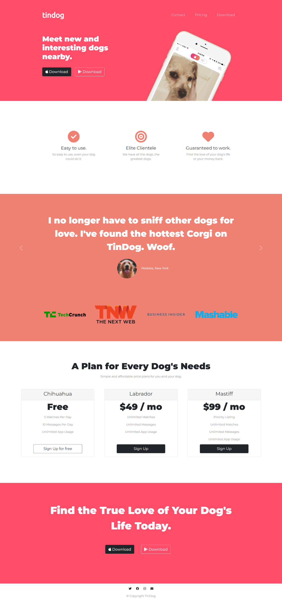

# 🐩 Tindog

Landing page for a fictional startup website Tindog inspired by Tinder. It allows the user to find other dogs and their owners nearby with similar interests by swiping right to like or swiping left to dislike other users' profiles.

## Deployment

Deployed Website : https://stutisharma273.github.io/Tindog/

## Built With

  * HTML
  * CSS
  * Bootstrap
  
## Authors

  *Stuti Sharma*
  [Stuti Sharma](https://github.com/StutiSharma273)
  
## Acknowledgements

  * The Complete 2022 Web Development Bootcamp by Angela Yu
